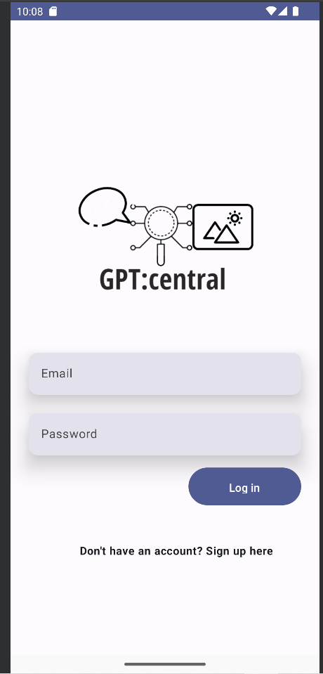
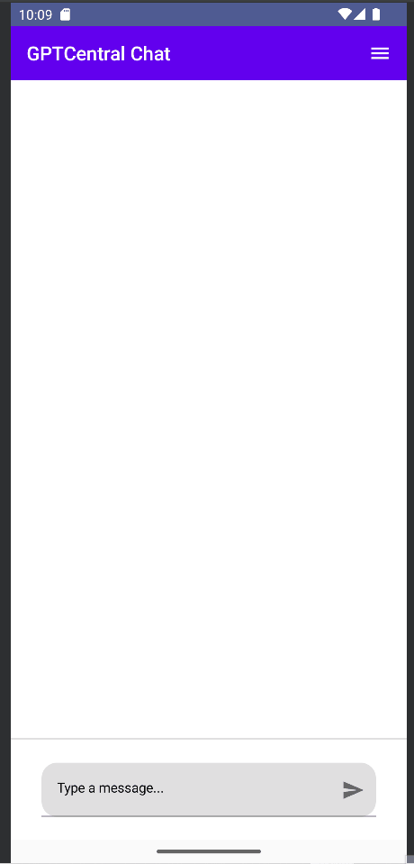
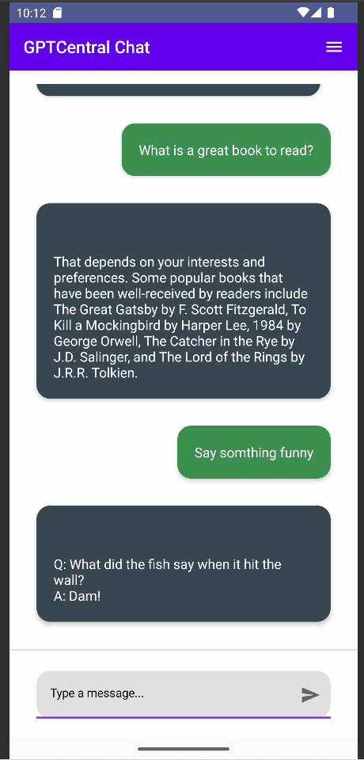

# GPT Central: ChatGPT Chatbot and Image Generator

Project by: **Shane Douglas**

## Summary

**GPT Central** is a project incorporating ChatGPT and Image Generation functionalities, with User Authentication provided by Firebase all done in Jetpack Compose

## Features

- [x] User Profile
- [x] User Authentication utilizing Firebase
- [x] Chat Bot
- [x] Image Generation and Download

## Prerequisites

To run this project, you will need to:

1. Set up Firebase for your project.
2. Obtain an API key from OpenAI.

## Setup

### Firebase Setup

To set up Firebase for your project, follow these steps:

1. Open Android Studio.
2. Navigate to the Tools tab and select Firebase. This will open the Firebase assistant on the right side.
3. Under Firebase Authentication, click on the "Authenticate using a custom authntication system" dropdown.
4. Click on the "Connect to Firebase" and 'Add the Firebase Authentication SDK" buttons to connect your app to Firebase. A browser window will open, asking you to sign in to your Firebase account. IF not then go to the [Firebase Website](https://firebase.google.com/?gad=1&gclid=Cj0KCQjwtamlBhD3ARIsAARoaEyCe-cOjOlmgUm8UuhH5FqKXO60IasPznBtm6t7NbhMMneNg301hfkaAlt3EALw_wcB&gclsrc=aw.ds) directly
5. After signing in, click on "Add project" and follow the instructions to create a new project in your Firebase account.
6. Once the project is created, download the `google-services.json` file.
7. Go back to Android Studio and open the project view (from the dropdown in the top-left corner of the screen that usually says "Android").
8. Place the `google-services.json` file into the `app` directory of your project and then switch back to the Android view.
9. Go back to the Firebase console in your browser.
10. Navigate to the "Storage" section and follow the instructions to set up a storage bucket.
11. Navigate to the "Realtime Database" section and follow the instructions to set up a database.
12. In the "Authentication" section, choose "Set up sign-in method" and select the "Email/Password" option. Enable it and save the changes.

### OpenAI API Key

1. Visit [OpenAI](https://beta.openai.com/signup/) and sign up for an account.
2. Generate an API key.
3. In the `imagegenactivity.kt` and `gptactvity.kt` files, replace `YOUR_API_KEY` with your actual api key obtained from OpenAI.

   

## Running the Project

To run the project, follow these steps:

1. Ensure you have all the prerequisites installed and set up.
2. Open the project in your preferred IDE.
3. Run the project.

## Project Demo

Here's a video / GIF that demos all of the app's implemented features:

### Login

### ChatBot

### Image Genration

### Profile

## Notes

- You wil need to pay for the OpenAI API key
- **Any Comments, concerns or feedback are always welcomed! :wink:** 

## License

Copyright 2023 Shane Douglas

Licensed under the Apache License, Version 2.0 (the "License");
you may not use this file except in compliance with the License.
You may obtain a copy of the License at

    http://www.apache.org/licenses/LICENSE-2.0

Unless required by applicable law or agreed to in writing, software
distributed under the License is distributed on an "AS IS" BASIS,
WITHOUT WARRANTIES OR CONDITIONS OF ANY KIND, either express or implied.
See the License for the specific language governing permissions and
limitations under the License.
